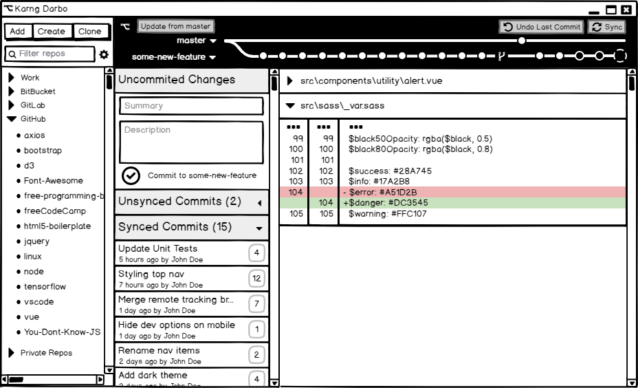

# Karng Darbo

## A cross-platform git GUI for Windows, Linux, and OSX.

### Made with [NW.js](https://nwjs.io), [Vue.js](https://vuejs.org), [Sass](https://sass-lang.com), and more

* * *

## Running locally for development

**Prerequisites:**

1. [Node.js and npm](http://nodejs.org) installed globally
1. [git](https://git-scm.com) installed globally

**Instructions:**

1. Fork/clone/download this repo
1. `npm install`
1. `npm run dev`
